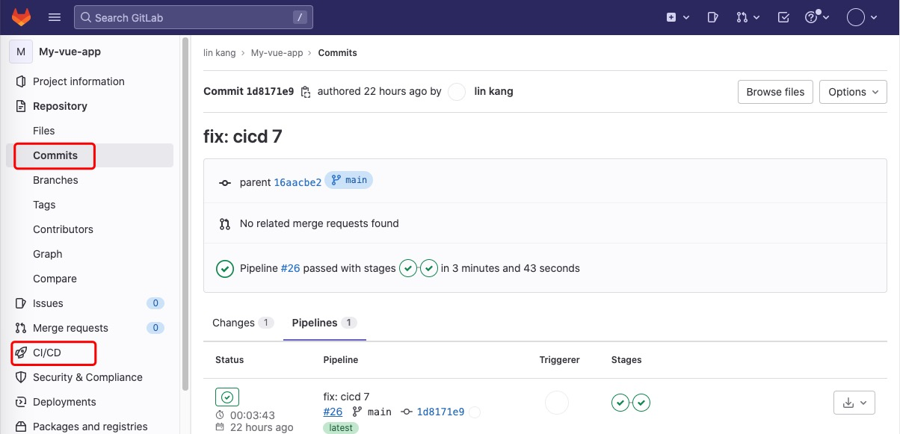

#  CICD自动构建流程

 通过gitlab + docker-compose + nginx + registry 流水线自动构建和发布流程，独立的打包服务环境和线上环境。
### gitlab 流水线构建


### gitlab registry 保存docker 镜像


### 发布


OnLine 环境只需安装docker即可
```
docker login -u "yourusername" -p "yourpassword" http://47.97.97.114:4567/  #登录registry

docker run --init -p 8000:80 -d 47.97.97.114:4567/klbest1/my-vue-app # 运行镜像
-p 绑定端口号，-d 表示后台运行。 如果是在云上环境，需要在安全组中开放8000端口，协议为tcp.

访问发布的地址：http:yourdomain:8000, 查看前端页面是否成功


## Project setup
```
npm install
```

### Compiles and hot-reloads for development
```
npm run serve
```

### Compiles and minifies for production
```
npm run build
```

### Lints and fixes files
```
npm run lint
```

### Customize configuration
See [Configuration Reference](https://cli.vuejs.org/config/).
